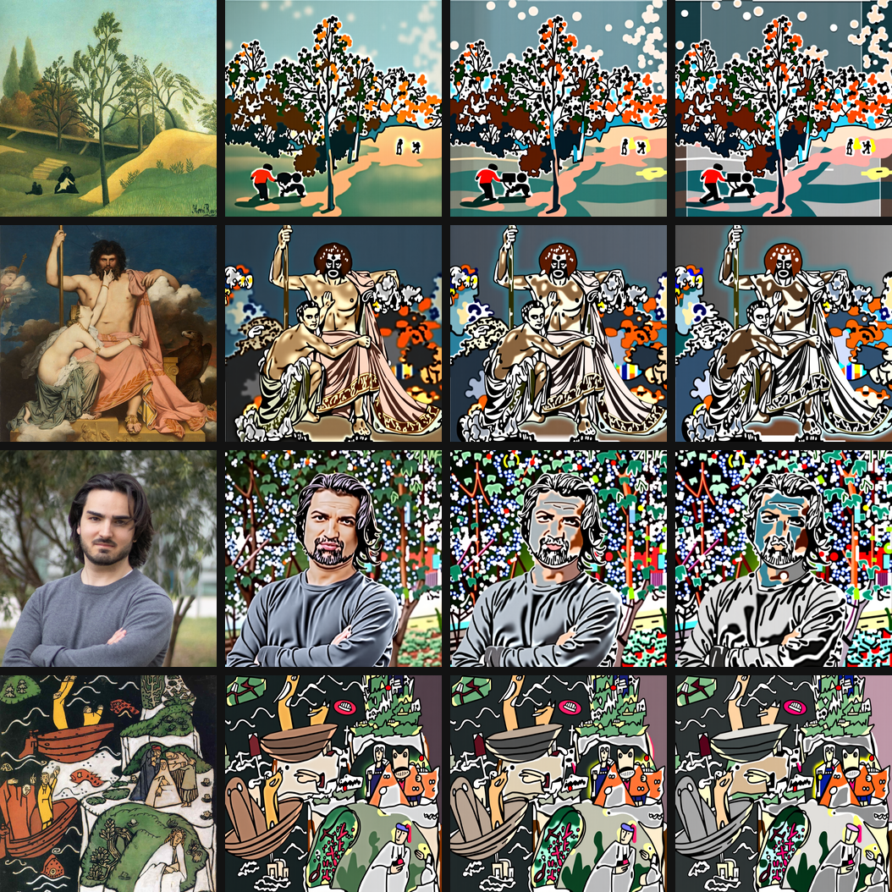
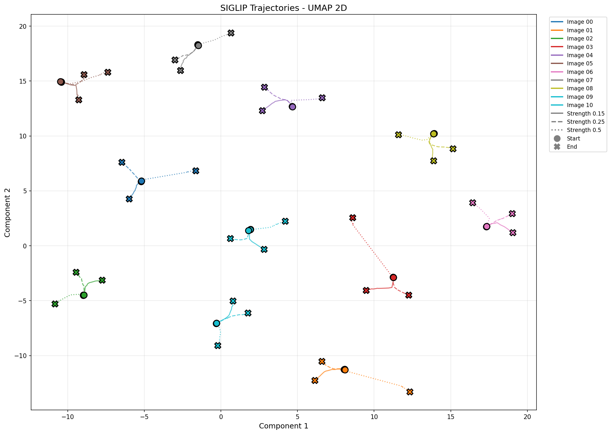
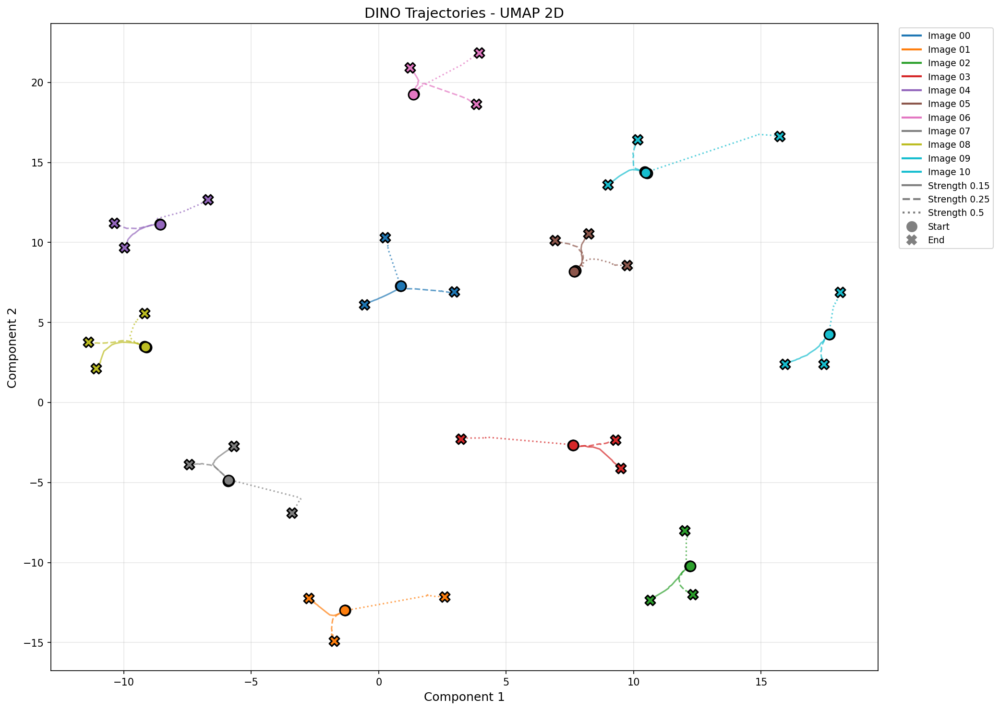
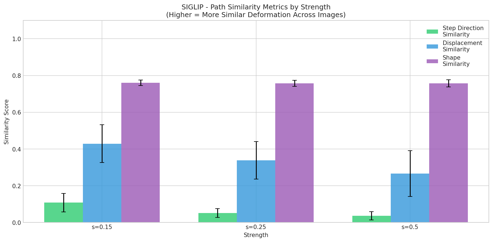
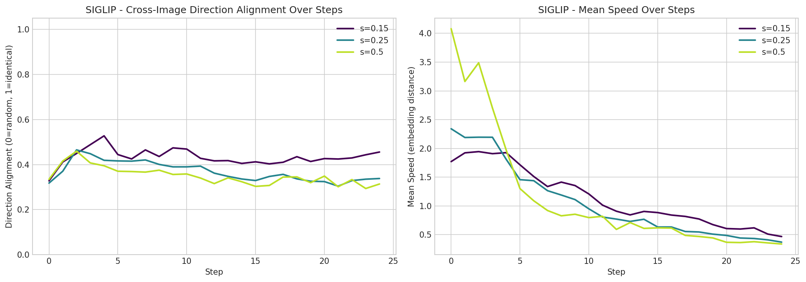
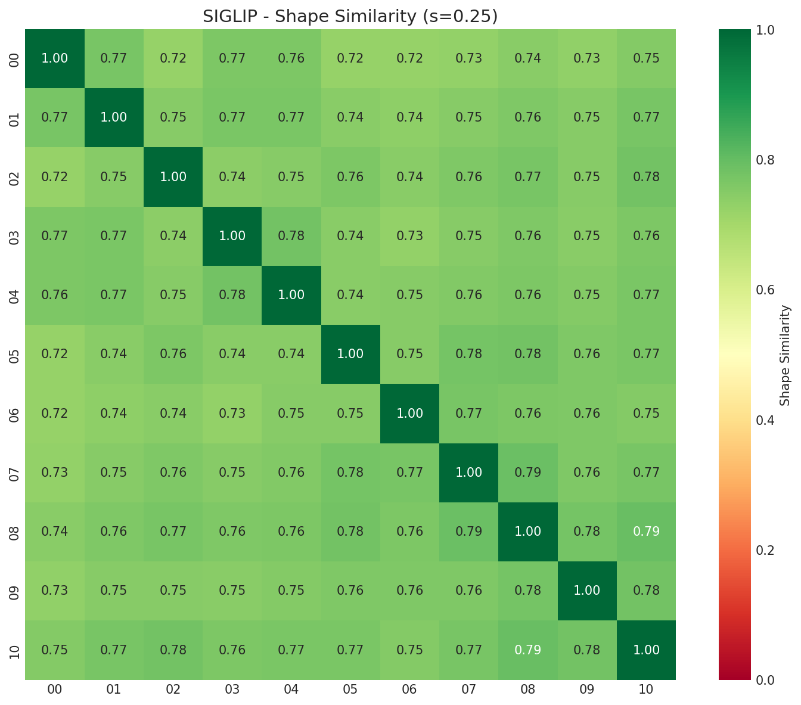
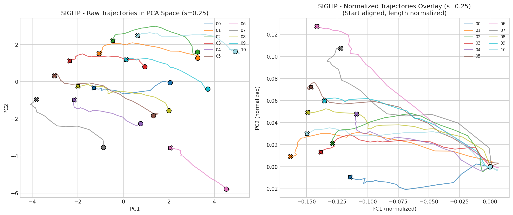
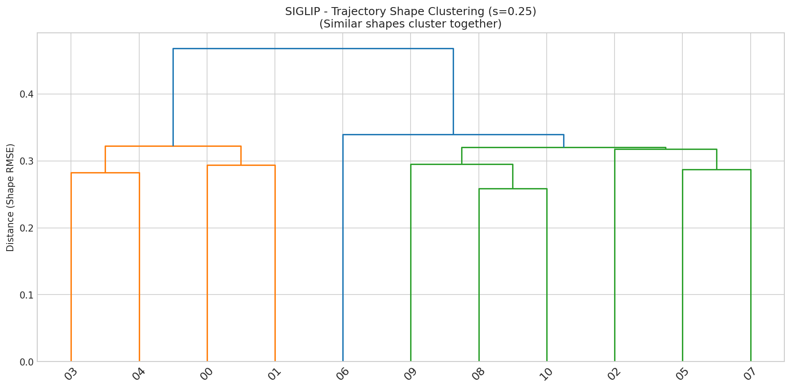
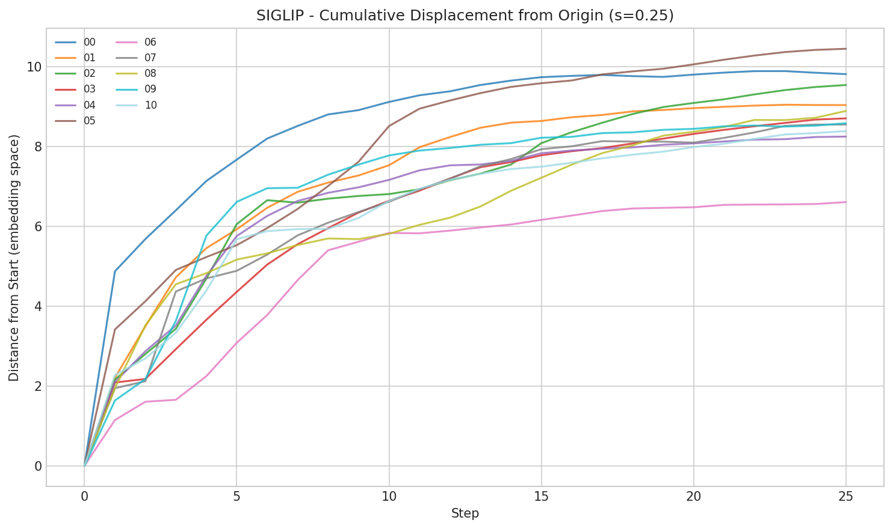

# BiasLoop: Diffusion Self-Loop Diagnostics

This repo diagnoses and amplifies diffusion model biases by creating a self-loop over the same image at different strengths, then analyzing how trajectories deform across style, content, and abstract structure using embeddings. The goal is to measure whether a model pushes images in a consistent direction, and how that direction changes with loop strength.

## Core Idea
- Loop an image through the same model N times
- Use different strengths to modulate how hard the model overwrites the input
- Embed every step with SigLip2 and DINOv3
- Compare trajectory paths across images to see if deformation is consistent

## Methodology Note

To prevent VAE reconstruction artifacts from contaminating our bias measurements, all self-loop iterations were performed directly in the latent space of the FLUX diffusion transformer. The VAE was only used to encode the initial input image and to decode final results for visualization. This ensures that observed trajectory deformations reflect genuine model biases rather than VAE encoding/decoding artifacts.

## Visual Overview

### Raw Trajectory Evolution

What happens when we repeatedly feed an image back into the same diffusion model? The grid below shows four different input images (rows) as they evolve over 25 iterations at strength 0.5. Each row reveals how a single image transforms step-by-step—watch how colors shift, textures change, and details drift. The key question: do different images deform in similar ways, or does each follow its own path?



### Embedding Space Trajectories

To understand deformation beyond pixel-level changes, we embed every step using SigLip2 (semantic vision-language) and DINOv3 (self-supervised visual features). These projections reveal the *semantic* and *structural* paths images take through embedding space. Each colored line represents one image's journey—do they converge, diverge, or follow parallel routes? The fact that trajectories cluster rather than scatter randomly suggests the model has a consistent "preference" for certain directions in semantic space.

**SigLip2 Embeddings** (captures semantic content and style):


**DINOv3 Embeddings** (captures visual structure and features):


### Quantitative Similarity Analysis

#### Overall Similarity by Strength

How similar are trajectories across different images? This bar chart compares three key metrics across different loop strengths. Higher values mean images deform more similarly. Notice how similarity *decreases* as strength increases—stronger loops amplify differences rather than converging to a single point. This suggests the model's bias is directionally consistent but not uniform.



#### Step-by-Step Alignment

Do all images move in the same direction at each step? The alignment metric (top) measures how consistent the step directions are across images—values near 1 mean all images move together, while values near 0 mean random directions. The speed profile (bottom) shows how fast images drift through embedding space. Both reveal that alignment is weak but non-zero, indicating partial but measurable bias.



#### Pairwise Shape Similarity

Which image pairs deform most similarly? This heatmap shows normalized path shape similarity—after aligning trajectories at the origin and normalizing length, how similar are the geometric paths? Warmer colors indicate more similar deformation patterns. The clustering structure reveals groups of images that respond to the loop in comparable ways, suggesting shared biases rather than uniform behavior.



#### Normalized Trajectory Overlay

When we align all trajectories at the origin and normalize their lengths, do they overlap? The right panel shows this normalized view—if trajectories were identical, all lines would coincide. Instead, we see a family of similar but distinct paths, confirming that while deformation follows a shared pattern, individual images retain unique trajectories. This geometric consistency is what makes the bias measurable.



#### Hierarchical Clustering by Path Shape

Which images cluster together based on their deformation paths? This dendrogram groups images by trajectory shape similarity. Images that branch together have undergone similar transformations—the tree structure reveals natural groupings in how the model processes different inputs. Tight clusters suggest shared biases, while isolated branches indicate unique responses.



#### Cumulative Displacement

How far does each image drift from its starting point? This plot tracks the Euclidean distance from the original embedding over time. Steeper curves mean faster drift, while parallel curves suggest similar drift rates. The spread between curves shows how much variation exists in deformation magnitude—some images transform more dramatically than others, even under the same loop conditions.



## Results
The trajectories show a consistent but weak directional bias across images, and the bias weakens as strength increases. Across SigLip2 embeddings, mean step-direction similarity drops from 0.108 at strength 0.15 to 0.036 at 0.5, while net displacement similarity drops from 0.429 to 0.267. DINOv3 shows the same pattern: step-direction similarity falls from 0.091 to 0.030, and displacement similarity from 0.435 to 0.259. This indicates that higher strength produces more divergent step-by-step motion across inputs, even if the overall deformation still trends in roughly similar directions.

Despite the divergence in step directions, the normalized path shapes remain relatively similar across images. Shape similarity stays high in both encoders (SigLip2: ~0.757–0.760, DINOv3: ~0.746–0.771), suggesting the loop induces comparable trajectory geometries even when exact directions vary. The heatmaps and clustering confirm this: images group by similar path shapes, but alignment is not uniform across all inputs.

In short, the self-loop reveals a measurable global bias: trajectories are not random, but they are only partially aligned. Stronger loops increase deformation magnitude and reduce cross-image agreement, while preserving a shared geometric pattern in the embedding path. This supports using embedding-space trajectory analysis as a diagnostic for systematic diffusion bias.

## Pipeline
1. Generate trajectories (FLUX or Qwen)
2. Extract embeddings for each step
3. Project trajectories into 2D/3D
4. Quantify path similarity and deformation consistency

## Folder Structure
```
input_images/
output_trajectories_flux_dev/
output_trajectories_qwen/
embeddings_flux_dev/
plots_flux_dev/
trajectory_analysis/
readme_assets/
```

## Setup
```
pip install diffusers transformers torch torchvision pillow tqdm pandas numpy umap-learn matplotlib seaborn scipy scikit-learn
```

## 1) Generate FLUX Trajectories
Script: `flux_trajectory.py`

Run:
```
python flux_trajectory.py
```

## 2) Generate Qwen Trajectories
Script: `qwen_trajectory.py`

Run:
```
python qwen_trajectory.py
```

## 3) Extract Embeddings
Script: `extract_embeddings.py`

Run:
```
python extract_embeddings.py
```

## 4) Visualize Trajectories
Script: `visualize_trajectories.py`

Run:
```
python visualize_trajectories.py
```

## 5) Trajectory Similarity + Plots
Script: `trajectory_similarity.py`

Run:
```
python trajectory_similarity.py
```

## 6) Build README Assets
Script: `build_readme_assets.py`

This pulls selected plots and builds step grids from the images stored at `F:\ImageGenerationTrajectories` and saves them to `readme_assets/`.

Run:
```
python build_readme_assets.py
```

## Notes
- `input_images/` must contain `.jpg` files
- Adjust `N`, `num_inference_steps`, `strengths`, and image size in each script
- Embeddings and analysis are generated for FLUX trajectories by default

## Quick Start
```
python flux_trajectory.py
python extract_embeddings.py
python visualize_trajectories.py
python trajectory_similarity.py
python build_readme_assets.py
```
